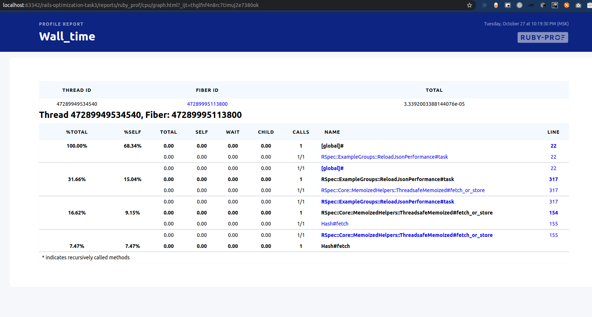

# Test-3.rb

Created: Oct 26, 2020 9:47 PM
Updated: Nov 1, 2020 1:02 PM

Первый отчет memory_profiler:

```bash
(base) theendcomplete@N10L:~/Documents/projects/my/rails-optimization-task3$ bundle exec rspec spec/benchmarks/reload_json_benchmark.rb
Total allocated: 351818774 bytes (3606945 objects)
Total retained:  325072 bytes (2747 objects)

allocated memory by gem
-----------------------------------
 225572626  activerecord-5.2.3
  55090317  activesupport-5.2.3
  34205501  activemodel-5.2.3
  17553760  arel-9.0.0
  11403817  i18n-1.6.0
   2870308  rails-optimization-task3/lib
   2301380  set
   1451622  json
   1161946  logger
    153682  bootsnap-1.4.2
     36848  rails-optimization-task3/app
     14456  concurrent-ruby-1.1.5
       968  rake-12.3.2
       504  monitor
       504  mutex_m
       415  railties-5.2.3
       120  other

allocated memory by file
-----------------------------------
  44767201  /home/theendcomplete/.rbenv/versions/2.6.3/lib/ruby/gems/2.6.0/gems/activerecord-5.2.3/lib/active_record/connection_adapters/postgresql_adapter.rb
  28318293  /home/theendcomplete/.rbenv/versions/2.6.3/lib/ruby/gems/2.6.0/gems/activerecord-5.2.3/lib/active_record/log_subscriber.rb
  25421816  /home/theendcomplete/.rbenv/versions/2.6.3/lib/ruby/gems/2.6.0/gems/activerecord-5.2.3/lib/active_record/relation.rb
  19116864  /home/theendcomplete/.rbenv/versions/2.6.3/lib/ruby/gems/2.6.0/gems/activesupport-5.2.3/lib/active_support/callbacks.rb
  12801950  /home/theendcomplete/.rbenv/versions/2.6.3/lib/ruby/gems/2.6.0/gems/activemodel-5.2.3/lib/active_model/errors.rb
   8679976  /home/theendcomplete/.rbenv/versions/2.6.3/lib/ruby/gems/2.6.0/gems/activerecord-5.2.3/lib/active_record/relation/query_methods.rb
   8397808  /home/theendcomplete/.rbenv/versions/2.6.3/lib/ruby/gems/2.6.0/gems/activerecord-5.2.3/lib/active_record/reflection.rb
   8334640  /home/theendcomplete/.rbenv/versions/2.6.3/lib/ruby/gems/2.6.0/gems/activerecord-5.2.3/lib/active_record/relation/where_clause.rb
   7794403  /home/theendcomplete/.rbenv/versions/2.6.3/lib/ruby/gems/2.6.0/gems/activerecord-5.2.3/lib/active_record/connection_adapters/postgresql/database_statements.rb
   7562992  /home/theendcomplete/.rbenv/versions/2.6.3/lib/ruby/gems/2.6.0/gems/activerecord-5.2.3/lib/active_record/relation/predicate_builder.rb
   6123968  /home/theendcomplete/.rbenv/versions/2.6.3/lib/ruby/gems/2.6.0/gems/activemodel-5.2.3/lib/active_model/attribute.rb
   5754258  /home/theendcomplete/.rbenv/versions/2.6.3/lib/ruby/gems/2.6.0/gems/activerecord-5.2.3/lib/active_record/autosave_association.rb
   5547824  /home/theendcomplete/.rbenv/versions/2.6.3/lib/ruby/gems/2.6.0/gems/activerecord-5.2.3/lib/active_record/transactions.rb
   5238056  /home/theendcomplete/.rbenv/versions/2.6.3/lib/ruby/gems/2.6.0/gems/activerecord-5.2.3/lib/active_record/connection_adapters/abstract_adapter.rb
   5052264  /home/theendcomplete/.rbenv/versions/2.6.3/lib/ruby/gems/2.6.0/gems/activerecord-5.2.3/lib/active_record/querying.rb
   4937424  /home/theendcomplete/.rbenv/versions/2.6.3/lib/ruby/gems/2.6.0/gems/activerecord-5.2.3/lib/active_record/core.rb
   4419736  /home/theendcomplete/.rbenv/versions/2.6.3/lib/ruby/gems/2.6.0/gems/activerecord-5.2.3/lib/active_record/persistence.rb
   4413600  /home/theendcomplete/.rbenv/versions/2.6.3/lib/ruby/gems/2.6.0/gems/i18n-1.6.0/lib/i18n/interpolate/ruby.rb
   4370612  /home/theendcomplete/.rbenv/versions/2.6.3/lib/ruby/gems/2.6.0/gems/i18n-1.6.0/lib/i18n/backend/base.rb
   4304312  /home/theendcomplete/.rbenv/versions/2.6.3/lib/ruby/gems/2.6.0/gems/activerecord-5.2.3/lib/active_record/relation/spawn_methods.rb
   4287102  /home/theendcomplete/.rbenv/versions/2.6.3/lib/ruby/gems/2.6.0/gems/activerecord-5.2.3/lib/active_record/relation/delegation.rb
  

allocated memory by class
-----------------------------------
 109364800  Hash
  74928752  Array
  61517463  String
  42622720  PG::Result
   6469440  Proc
   5798696  Class
   4679168  ActiveRecord::Relation
   4528440  MatchData
   3706616  ActiveModel::Attribute::FromDatabase
   2911136  ActiveSupport::HashWithIndifferentAccess
   2838528  Enumerator
   2440360  ActiveRecord::Relation::WhereClause
   2066696  ActiveRecord::Relation::QueryAttribute
   2034080  ActiveModel::Attribute::FromUser
   1966751  Regexp
   1529136  Thread::Backtrace
   1528736  Time
   1298208  ActiveSupport::Notifications::Event
   1293560  Arel::Attributes::Attribute
   1283400  Arel::Nodes::BindParam
    972288  ActiveRecord::Result
    921128  Arel::Nodes::SelectCore
    867600  Service
    779416  Arel::Nodes::SelectStatement
    720992  ActiveModel::LazyAttributeHash
    708160  ActiveModel::Attribute::WithCastValue
    684600  ActiveModel::AttributeSet
    656016  ActiveRecord::AssociationRelation
    624000  ActiveRecord::Relation::WhereClauseFactory
    606880  ActiveSupport::Callbacks::Filters::Environment
    585744  ActiveRecord::Associations::BelongsToAssociation
    572960  ActiveRecord::Relation::Merger
    524880  Arel::Collectors::Bind
    524880  Arel::Collectors::Composite
    524880  Arel::Collectors::SQLString
    466360  Arel::Nodes::Equality
    463232  HABTM_Services
    396680  Set
    396640  ActiveModel::AttributeMutationTracker
    354280  Arel::Nodes::JoinSource
    354280  Arel::Nodes::SqlLiteral
    354280  Arel::SelectManager
    354120  Arel::Nodes::And
    354080  Arel::Nodes::Limit
    354080  Arel::Nodes::Top
    307088  Arel::Nodes::InsertStatement
    290960  ActiveModel::Errors
    240488  City
    191704  Bus
    176000  Trip

allocated objects by gem
-----------------------------------
   2187313  activerecord-5.2.3
    576369  activesupport-5.2.3
    386334  activemodel-5.2.3
    324041  arel-9.0.0
     67832  i18n-1.6.0
     21232  json
     17467  rails-optimization-task3/lib
     13511  logger
      9922  set
      2704  bootsnap-1.4.2
        92  concurrent-ruby-1.1.5
        91  rails-optimization-task3/app
        13  rake-12.3.2
         7  monitor
         7  mutex_m
         7  railties-5.2.3
         3  other
```

Профилирование CPU не дало большей подсказки, чем дано в ридми, а значит - образаемся к activerecord_import:




Замена JSON.load на OJ помогла выиграть пару секунд:

```bash
(base) theendcomplete@N10L:~/Documents/projects/my/rails-optimization-task3$ bundle exec rspec spec/benchmarks/reload_json_memory_benchmark.rb
Total allocated: 351932631 bytes (3606943 objects)
Total retained:  325152 bytes (2749 objects)

allocated memory by gem
-----------------------------------
 225572626  activerecord-5.2.3
  55090317  activesupport-5.2.3
  34205501  activemodel-5.2.3
  17553760  arel-9.0.0
  11403817  i18n-1.6.0
   4435787  rails-optimization-task3/lib
   2301380  set
   1161946  logger
    153682  bootsnap-1.4.2
     36848  rails-optimization-task3/app
     14456  concurrent-ruby-1.1.5
       968  rake-12.3.2
       504  monitor
       504  mutex_m
       415  railties-5.2.3
       120  other

allocated memory by file
-----------------------------------
  44767201  /home/theendcomplete/.rbenv/versions/2.6.3/lib/ruby/gems/2.6.0/gems/activerecord-5.2.3/lib/active_record/connection_adapters/postgresql_adapter.rb
  28318293  /home/theendcomplete/.rbenv/versions/2.6.3/lib/ruby/gems/2.6.0/gems/activerecord-5.2.3/lib/active_record/log_subscriber.rb
  25421816  /home/theendcomplete/.rbenv/versions/2.6.3/lib/ruby/gems/2.6.0/gems/activerecord-5.2.3/lib/active_record/relation.rb
  19116864  /home/theendcomplete/.rbenv/versions/2.6.3/lib/ruby/gems/2.6.0/gems/activesupport-5.2.3/lib/active_support/callbacks.rb
  12801950  /home/theendcomplete/.rbenv/versions/2.6.3/lib/ruby/gems/2.6.0/gems/activemodel-5.2.3/lib/active_model/errors.rb
   8679976  /home/theendcomplete/.rbenv/versions/2.6.3/lib/ruby/gems/2.6.0/gems/activerecord-5.2.3/lib/active_record/relation/query_methods.rb
   8397808  /home/theendcomplete/.rbenv/versions/2.6.3/lib/ruby/gems/2.6.0/gems/activerecord-5.2.3/lib/active_record/reflection.rb
   8334640  /home/theendcomplete/.rbenv/versions/2.6.3/lib/ruby/gems/2.6.0/gems/activerecord-5.2.3/lib/active_record/relation/where_clause.rb
   7794403  /home/theendcomplete/.rbenv/versions/2.6.3/lib/ruby/gems/2.6.0/gems/activerecord-5.2.3/lib/active_record/connection_adapters/postgresql/database_statements.rb
   7562992  /home/theendcomplete/.rbenv/versions/2.6.3/lib/ruby/gems/2.6.0/gems/activerecord-5.2.3/lib/active_record/relation/predicate_builder.rb
   6123968  /home/theendcomplete/.rbenv/versions/2.6.3/lib/ruby/gems/2.6.0/gems/activemodel-5.2.3/lib/active_model/attribute.rb
   

allocated memory by location
-----------------------------------
  24647088  /home/theendcomplete/.rbenv/versions/2.6.3/lib/ruby/gems/2.6.0/gems/activerecord-5.2.3/lib/active_record/connection_adapters/postgresql_adapter.rb:622
  17934336  /home/theendcomplete/.rbenv/versions/2.6.3/lib/ruby/gems/2.6.0/gems/activerecord-5.2.3/lib/active_record/connection_adapters/postgresql_adapter.rb:611
  15340704  /home/theendcomplete/.rbenv/versions/2.6.3/lib/ruby/gems/2.6.0/gems/activerecord-5.2.3/lib/active_record/log_subscriber.rb:37
  10150080  /home/theendcomplete/.rbenv/versions/2.6.3/lib/ruby/gems/2.6.0/gems/activesupport-5.2.3/lib/active_support/callbacks.rb:404
   6799224  /home/theendcomplete/.rbenv/versions/2.6.3/lib/ruby/gems/2.6.0/gems/activerecord-5.2.3/lib/active_record/relation.rb:29
   5722048  /home/theendcomplete/.rbenv/versions/2.6.3/lib/ruby/gems/2.6.0/gems/activerecord-5.2.3/lib/active_record/relation.rb:25
   4885456  /home/theendcomplete/.rbenv/versions/2.6.3/lib/ruby/gems/2.6.0/gems/activemodel-5.2.3/lib/active_model/errors.rb:189
   4413600  /home/theendcomplete/.rbenv/versions/2.6.3/lib/ruby/gems/2.6.0/gems/i18n-1.6.0/lib/i18n/interpolate/ruby.rb:23
   4400344  /home/theendcomplete/.rbenv/versions/2.6.3/lib/ruby/gems/2.6.0/gems/activerecord-5.2.3/lib/active_record/relation.rb:508
   4204089  /home/theendcomplete/.rbenv/versions/2.6.3/lib/ruby/gems/2.6.0/gems/activerecord-5.2.3/lib/active_record/log_subscriber.rb:35
   4183432  /home/theendcomplete/.rbenv/versions/2.6.3/lib/ruby/gems/2.6.0/gems/activerecord-5.2.3/lib/active_record/relation/delegation.rb:132
   3608932  /home/theendcomplete/.rbenv/versions/2.6.3/lib/ruby/gems/2.6.0/gems/activesupport-5.2.3/lib/active_support/tagged_logging.rb:23
   3591824  /home/theendcomplete/.rbenv/versions/2.6.3/lib/ruby/gems/2.6.0/gems/activerecord-5.2.3/lib/active_record/relation.rb:437
   3590896  /home/theendcomplete/.rbenv/versions/2.6.3/lib/ruby/gems/2.6.0/gems/activerecord-5.2.3/lib/active_record/relation.rb:36
   3505818  /home/theendcomplete/.rbenv/versions/2.6.3/lib/ruby/gems/2.6.0/gems/activesupport-5.2.3/lib/active_support/log_subscriber.rb:109
   3312384  /home/theendcomplete/.rbenv/versions/2.6.3/lib/ruby/gems/2.6.0/gems/activerecord-5.2.3/lib/active_record/autosave_association.rb:159
   3244000  /home/theendcomplete/.rbenv/versions/2.6.3/lib/ruby/gems/2.6.0/gems/activesupport-5.2.3/lib/active_support/callbacks.rb:198
   3138536  /home/theendcomplete/.rbenv/versions/2.6.3/lib/ruby/gems/2.6.0/gems/activerecord-5.2.3/lib/active_record/connection_adapters/abstract_adapter.rb:570


allocated memory by class
-----------------------------------
 109364568  Hash
  74928752  Array
  61632680  String
  42622720  PG::Result
   6469440  Proc
   5798696  Class
   4679168  ActiveRecord::Relation
   4528440  MatchData
   3706616  ActiveModel::Attribute::FromDatabase
   2911136  ActiveSupport::HashWithIndifferentAccess
   2838528  Enumerator
   2440360  ActiveRecord::Relation::WhereClause
     396640  ActiveModel::AttributeMutationTracker
    354280  Arel::Nodes::JoinSource
    354280  Arel::Nodes::SqlLiteral
    354280  Arel::SelectManager
    354120  Arel::Nodes::And
    354080  Arel::Nodes::Limit
    354080  Arel::Nodes::Top
    307088  Arel::Nodes::InsertStatement
    290960  ActiveModel::Errors
    240488  City
    191704  Bus
    176000  Trip

allocated objects by gem
-----------------------------------
   2187313  activerecord-5.2.3
    576369  activesupport-5.2.3
    386334  activemodel-5.2.3
    324041  arel-9.0.0
     67832  i18n-1.6.0
     38697  rails-optimization-task3/lib
     13511  logger
      9922  set
      2704  bootsnap-1.4.2
        92  concurrent-ruby-1.1.5
        91  rails-optimization-task3/app
        13  rake-12.3.2
         7  monitor
         7  mutex_m
         7  railties-5.2.3
         3  other

allocated objects by file
-----------------------------------
    263001  /home/theendcomplete/.rbenv/versions/2.6.3/lib/ruby/gems/2.6.0/gems/activerecord-5.2.3/lib/active_record/log_subscriber.rb
    209177  /home/theendcomplete/.rbenv/versions/2.6.3/lib/ruby/gems/2.6.0/gems/activesupport-5.2.3/lib/active_support/callbacks.rb
    195606  /home/theendcomplete/.rbenv/versions/2.6.3/lib/ruby/gems/2.6.0/gems/activerecord-5.2.3/lib/active_record/reflection.rb
    177022  /home/theendcomplete/.rbenv/versions/2.6.3/lib/ruby/gems/2.6.0/gems/activerecord-5.2.3/lib/active_record/relation/where_clause.rb
   
.

Finished in 27.05 seconds (files took 1.61 seconds to load)
1 example, 0 failures
```
После 
```bash
(base) theendcomplete@N10L:~/Documents/projects/my/rails-optimization-task3$ bundle exec rspec spec/benchmarks/reload_json_memory_benchmark.rb
^[[5FTotal allocated: 351933991 bytes (3606944 objects)
Total retained:  325200 bytes (2747 objects)

allocated memory by gem
-----------------------------------
 225572626  activerecord-5.2.3
  55090317  activesupport-5.2.3
  34205501  activemodel-5.2.3
  17553760  arel-9.0.0
  11403817  i18n-1.6.0
   2985525  rails-optimization-task3/lib
   2301380  set
   1451622  json
   1161946  logger
    153682  bootsnap-1.4.2
     36848  rails-optimization-task3/app
     14456  concurrent-ruby-1.1.5
       968  rake-12.3.2
       504  monitor
       504  mutex_m
       415  railties-5.2.3
       120  other

allocated memory by file
-----------------------------------
  44767201  /home/theendcomplete/.rbenv/versions/2.6.3/lib/ruby/gems/2.6.0/gems/activerecord-5.2.3/lib/active_record/connection_adapters/postgresql_adapter.rb
  28318293  /home/theendcomplete/.rbenv/versions/2.6.3/lib/ruby/gems/2.6.0/gems/activerecord-5.2.3/lib/active_record/log_subscriber.rb

retained memory by gem
-----------------------------------
    143695  activerecord-5.2.3
     75262  activesupport-5.2.3
     30376  rails-optimization-task3/app
     24952  bootsnap-1.4.2
     17577  i18n-1.6.0
     15687  activemodel-5.2.3
     14456  concurrent-ruby-1.1.5
      1104  arel-9.0.0
       868  set
       504  monitor
       504  mutex_m
       175  railties-5.2.3
        40  other

retained memory by file
-----------------------------------
     37936  /home/theendcomplete/.rbenv/versions/2.6.3/lib/ruby/gems/2.6.0/gems/activesupport-5.2.3/lib/active_support/callbacks.rb
     30568  /home/theendcomplete/.rbenv/versions/2.6.3/lib/ruby/gems/2.6.0/gems/activerecord-5.2.3/lib/active_record/relation/delegation.rb
     15714  /home/theendcomplete/.rbenv/versions/2.6.3/lib/ruby/gems/2.6.0/gems/activerecord-5.2.3/lib/active_record/associations/builder/has_and_belongs_to_many.rb
     14934  /home/theendcomplete/.rbenv/versions/2.6.3/lib/ruby/gems/2.6.0/gems/activerecord-5.2.3/lib/active_record/attribute_methods.rb
     14869  /home/theendcomplete/.rbenv/versions/2.6.3/lib/ruby/gems/2.6.0/gems/i18n-1.6.0/lib/i18n/core_ext/hash.rb
     14033  /home/theendcomplete/.rbenv/versions/2.6.3/lib/ruby/gems/2.6.0/gems/bootsnap-1.4.2/lib/bootsnap/compile_cache/iseq.rb
     11216  /home/theendcomplete/.rbenv/versions/2.6.3/lib/ruby/gems/2.6.0/gems/concurrent-ruby-1.1.5/lib/concurrent/collection/map/non_concurrent_map_backend.rb
      9463  /home/theendcomplete/.rbenv/versions/2.6.3/lib/ruby/gems/2.6.0/gems/activemodel-5.2.3/lib/active_model/attribute_methods.rb
      9360  /home/theendcomplete/.rbenv/versions/2.6.3/lib/ruby/gems/2.6.0/gems/activesupport-5.2.3/lib/active_support/core_ext/module/redefine_method.rb
      8704  /home/theendcomplete/.rbenv/versions/2.6.3/lib/ruby/gems/2.6.0/gems/activerecord-5.2.3/lib/active_record/core.rb
      8328  /home/theendcomplete/Documents/projects/my/rails-optimization-task3/app/models/bus.rb
      8097  /home/theendcomplete/.rbenv/versions/2.6.3/lib/ruby/gems/2.6.0/gems/activesupport-5.2.3/lib/active_support/core_ext/class/attribute.rb
      8096  /home/theendcomplete/Documents/projects/my/rails-optimization-task3/app/models/service.rb
      7424  /home/theendcomplete/.rbenv/versions/2.6.3/lib/ruby/gems/2.6.0/gems/activesupport-5.2.3/lib/active_support/core_ext/array/extract_options.rb
      7192  /home/theendcomplete/.rbenv/versions/2.6.3/lib/ruby/gems/2.6.0/gems/activesupport-5.2.3/lib/active_support/core_ext/hash/except.rb
      6963  /home/theendcomplete/.rbenv/versions/2.6.3/lib/ruby/gems/2.6.0/gems/bootsnap-1.4.2/lib/bootsnap/compile_cache/yaml.rb
      6480  /home/theendcomplete/Documents/projects/my/rails-optimization-task3/app/models/trip.rb
      5210  /home/theendcomplete/.rbenv/versions/2.6.3/lib/ruby/gems/2.6.0/gems/activerecord-5.2.3/lib/active_record/statement_cache.rb
      5012  /home/theendcomplete/.rbenv/versions/2.6.3/lib/ruby/gems/2.6.0/gems/activerecord-5.2.3/lib/active_record/autosave_association.rb
      4872  /home/theendcomplete/Documents/projects/my/rails-optimization-task3/app/models/city.rb
      4624  /home/theendcomplete/.rbenv/versions/2.6.3/lib/ruby/gems/2.6.0/gems/activerecord-5.2.3/lib/active_record/connection_adapters/postgresql/schema_statements.rb
      4604  /home/theendcomplete/.rbenv/versions/2.6.3/lib/ruby/gems/2.6.0/gems/activerecord-5.2.3/lib/active_record/associations/join_dependency.rb
      4528  /home/theendcomplete/.rbenv/versions/2.6.3/lib/ruby/gems/2.6.0/gems/activerecord-5.2.3/lib/active_record/associations/builder/collection_association.rb
      3936  /home/theendcomplete/.rbenv/versions/2.6.3/lib/ruby/gems/2.6.0/gems/activerecord-5.2.3/lib/active_record/model_schema.rb
      3584  /home/theendcomplete/.rbenv/versions/2.6.3/lib/ruby/gems/2.6.0/gems/activerecord-5.2.3/lib/active_record/attribute_decorators.rb
      3440  /home/theendcomplete/.rbenv/versions/2.6.3/lib/ruby/gems/2.6.0/gems/activerecord-5.2.3/lib/active_record/relation/predicate_builder.rb
      3375  /home/theendcomplete/.rbenv/versions/2.6.3/lib/ruby/gems/2.6.0/gems/bootsnap-1.4.2/lib/bootsnap/load_path_cache/loaded_features_index.rb
      3312  /home/theendcomplete/.rbenv/versions/2.6.3/lib/ruby/gems/2.6.0/gems/activerecord-5.2.3/lib/active_record/legacy_yaml_adapter.rb
      3240  /home/theendcomplete/.rbenv/versions/2.6.3/lib/ruby/gems/2.6.0/gems/concurrent-ruby-1.1.5/lib/concurrent/collection/map/mri_map_backend.rb
      2768  /home/theendcomplete/.rbenv/versions/2.6.3/lib/ruby/gems/2.6.0/gems/activerecord-5.2.3/lib/active_record/reflection.rb
      2600  /home/theendcomplete/Documents/projects/my/rails-optimization-task3/app/models/application_record.rb
      2568  /home/theendcomplete/.rbenv/versions/2.6.3/lib/ruby/gems/2.6.0/gems/activerecord-5.2.3/lib/active_record/associations/association_scope.rb
      2024  /home/theendcomplete/.rbenv/versions/2.6.3/lib/ruby/gems/2.6.0/gems/activemodel-5.2.3/lib/active_model/validations.rb
      1983  /home/theendcomplete/.rbenv/versions/2.6.3/lib/ruby/gems/2.6.0/gems/activerecord-5.2.3/lib/active_record/connection_adapters/postgresql/database_statements.rb
      1966  /home/theendcomplete/.rbenv/versions/2.6.3/lib/ruby/gems/2.6.0/gems/activerecord-5.2.3/lib/active_record/associations/has_many_through_association.rb
      1952  /home/theendcomplete/.rbenv/versions/2.6.3/lib/ruby/gems/2.6.0/gems/activerecord-5.2.3/lib/active_record/associations.rb
      1848  /home/theendcomplete/.rbenv/versions/2.6.3/lib/ruby/gems/2.6.0/gems/activerecord-5.2.3/lib/active_record/associations/builder/singular_association.rb
      1656  /home/theendcomplete/.rbenv/versions/2.6.3/lib/ruby/gems/2.6.0/gems/activerecord-5.2.3/lib/active_record/associations/builder/belongs_to.rb
      1624  /home/theendcomplete/.rbenv/versions/2.6.3/lib/ruby/gems/2.6.0/gems/activesupport-5.2.3/lib/active_support/core_ext/object/deep_dup.rb
      1502  /home/theendcomplete/.rbenv/versions/2.6.3/lib/ruby/gems/2.6.0/gems/activerecord-5.2.3/lib/active_record/associations/has_many_association.rb
      1440  /home/theendcomplete/.rbenv/versions/2.6.3/lib/ruby/gems/2.6.0/gems/activerecord-5.2.3/lib/active_record/connection_adapters/schema_cache.rb
      1390  /home/theendcomplete/.rbenv/versions/2.6.3/lib/ruby/gems/2.6.0/gems/activerecord-5.2.3/lib/active_record/associations/alias_tracker.rb
      1360  /home/theendcomplete/.rbenv/versions/2.6.3/lib/ruby/gems/2.6.0/gems/i18n-1.6.0/lib/i18n.rb
      1344  /home/theendcomplete/.rbenv/versions/2.6.3/lib/ruby/gems/2.6.0/gems/activemodel-5.2.3/lib/active_model/attribute.rb
      1339  /home/theendcomplete/.rbenv/versions/2.6.3/lib/ruby/gems/2.6.0/gems/activerecord-5.2.3/lib/active_record/dynamic_matchers.rb
      1310  /home/theendcomplete/.rbenv/versions/2.6.3/lib/ruby/gems/2.6.0/gems/activerecord-5.2.3/lib/active_record/associations/belongs_to_association.rb
      1270  /home/theendcomplete/.rbenv/versions/2.6.3/lib/ruby/gems/2.6.0/gems/activerecord-5.2.3/lib/active_record/attribute_methods/read.rb
      1265  /home/theendcomplete/.rbenv/versions/2.6.3/lib/ruby/gems/2.6.0/gems/activerecord-5.2.3/lib/active_record/connection_adapters/postgresql_adapter.rb
      1226  /home/theendcomplete/.rbenv/versions/2.6.3/lib/ruby/gems/2.6.0/gems/activesupport-5.2.3/lib/active_support/core_ext/module/delegation.rb
      1174  /home/theendcomplete/.rbenv/versions/2.6.3/lib/ruby/gems/2.6.0/gems/activerecord-5.2.3/lib/active_record/associations/join_dependency/join_part.rb

retained memory by location
-----------------------------------
     22168  /home/theendcomplete/.rbenv/versions/2.6.3/lib/ruby/gems/2.6.0/gems/activerecord-5.2.3/lib/active_record/relation/delegation.rb:17
     14033  /home/theendcomplete/.rbenv/versions/2.6.3/lib/ruby/gems/2.6.0/gems/bootsnap-1.4.2/lib/bootsnap/compile_cache/iseq.rb:18
     13600  /home/theendcomplete/.rbenv/versions/2.6.3/lib/ruby/gems/2.6.0/gems/activerecord-5.2.3/lib/active_record/attribute_methods.rb:47
     11136  /home/theendcomplete/.rbenv/versions/2.6.3/lib/ruby/gems/2.6.0/gems/concurrent-ruby-1.1.5/lib/concurrent/collection/map/non_concurrent_map_backend.rb:16
     11136  /home/theendcomplete/.rbenv/versions/2.6.3/lib/ruby/gems/2.6.0/gems/i18n-1.6.0/lib/i18n/core_ext/hash.rb:15
      9360  /home/theendcomplete/.rbenv/versions/2.6.3/lib/ruby/gems/2.6.0/gems/activesupport-5.2.3/lib/active_support/core_ext/module/redefine_method.rb:29
      8904  /home/theendcomplete/.rbenv/versions/2.6.3/lib/ruby/gems/2.6.0/gems/activerecord-5.2.3/lib/active_record/associations/builder/has_and_belongs_to_many.rb:49
      8719  /home/theendcomplete/.rbenv/versions/2.6.3/lib/ruby/gems/2.6.0/gems/activemodel-5.2.3/lib/active_model/attribute_methods.rb:380
      7424  /home/theendcomplete/.rbenv/versions/2.6.3/lib/ruby/gems/2.6.0/gems/activesupport-5.2.3/lib/active_support/core_ext/array/extract_options.rb:30
      7264  /home/theendcomplete/Documents/projects/my/rails-optimization-task3/app/models/bus.rb:1
      7264  /home/theendcomplete/Documents/projects/my/rails-optimization-task3/app/models/service.rb:1
      7192  /home/theendcomplete/.rbenv/versions/2.6.3/lib/ruby/gems/2.6.0/gems/activesupport-5.2.3/lib/active_support/core_ext/hash/except.rb:13
      6963  /home/theendcomplete/.rbenv/versions/2.6.3/lib/ruby/gems/2.6.0/gems/bootsnap-1.4.2/lib/bootsnap/compile_cache/yaml.rb:28
      5720  /home/theendcomplete/.rbenv/versions/2.6.3/lib/ruby/gems/2.6.0/gems/activerecord-5.2.3/lib/active_record/core.rb:226
      5568  /home/theendcomplete/.rbenv/versions/2.6.3/lib/ruby/gems/2.6.0/gems/activesupport-5.2.3/lib/active_support/callbacks.rb:841
      5344  /home/theendcomplete/Documents/projects/my/rails-optimization-task3/app/models/trip.rb:1
      4832  /home/theendcomplete/Documents/projects/my/rails-optimization-task3/app/models/city.rb:1
      4512  /home/theendcomplete/.rbenv/versions/2.6.3/lib/ruby/gems/2.6.0/gems/activesupport-5.2.3/lib/active_support/callbacks.rb:289
      4240  /home/theendcomplete/.rbenv/versions/2.6.3/lib/ruby/gems/2.6.0/gems/activesupport-5.2.3/lib/active_support/callbacks.rb:424
      3375  /home/theendcomplete/.rbenv/versions/2.6.3/lib/ruby/gems/2.6.0/gems/bootsnap-1.4.2/lib/bootsnap/load_path_cache/loaded_features_index.rb:109
      3360  /home/theendcomplete/.rbenv/versions/2.6.3/lib/ruby/gems/2.6.0/gems/activerecord-5.2.3/lib/active_record/relation/delegation.rb:42
      3240  /home/theendcomplete/.rbenv/versions/2.6.3/lib/ruby/gems/2.6.0/gems/concurrent-ruby-1.1.5/lib/concurrent/collection/map/mri_map_backend.rb:14
      3024  /home/theendcomplete/.rbenv/versions/2.6.3/lib/ruby/gems/2.6.0/gems/activesupport-5.2.3/lib/active_support/callbacks.rb:462
      2800  /home/theendcomplete/.rbenv/versions/2.6.3/lib/ruby/gems/2.6.0/gems/activesupport-5.2.3/lib/active_support/callbacks.rb:450
      2786  /home/theendcomplete/.rbenv/versions/2.6.3/lib/ruby/gems/2.6.0/gems/activesupport-5.2.3/lib/active_support/core_ext/class/attribute.rb:104
      2786  /home/theendcomplete/.rbenv/versions/2.6.3/lib/ruby/gems/2.6.0/gems/activesupport-5.2.3/lib/active_support/core_ext/class/attribute.rb:99
      2720  /home/theendcomplete/.rbenv/versions/2.6.3/lib/ruby/gems/2.6.0/gems/activerecord-5.2.3/lib/active_record/autosave_association.rb:153
      2600  /home/theendcomplete/Documents/projects/my/rails-optimization-task3/app/models/application_record.rb:1
      2480  /home/theendcomplete/.rbenv/versions/2.6.3/lib/ruby/gems/2.6.0/gems/activesupport-5.2.3/lib/active_support/callbacks.rb:483
      2184  /home/theendcomplete/.rbenv/versions/2.6.3/lib/ruby/gems/2.6.0/gems/activerecord-5.2.3/lib/active_record/core.rb:148
      2053  /home/theendcomplete/.rbenv/versions/2.6.3/lib/ruby/gems/2.6.0/gems/i18n-1.6.0/lib/i18n/core_ext/hash.rb:30
      2016  /home/theendcomplete/.rbenv/versions/2.6.3/lib/ruby/gems/2.6.0/gems/activesupport-5.2.3/lib/active_support/callbacks.rb:464
      1983  /home/theendcomplete/.rbenv/versions/2.6.3/lib/ruby/gems/2.6.0/gems/activerecord-5.2.3/lib/active_record/connection_adapters/postgresql/database_statements.rb:24
      1904  /home/theendcomplete/.rbenv/versions/2.6.3/lib/ruby/gems/2.6.0/gems/activerecord-5.2.3/lib/active_record/attribute_decorators.rb:67
      1904  /home/theendcomplete/.rbenv/versions/2.6.3/lib/ruby/gems/2.6.0/gems/activerecord-5.2.3/lib/active_record/connection_adapters/postgresql/schema_statements.rb:653
      1886  /home/theendcomplete/.rbenv/versions/2.6.3/lib/ruby/gems/2.6.0/gems/activerecord-5.2.3/lib/active_record/associations/join_dependency.rb:261
      1880  /home/theendcomplete/.rbenv/versions/2.6.3/lib/ruby/gems/2.6.0/gems/activesupport-5.2.3/lib/active_support/callbacks.rb:302
      1680  /home/theendcomplete/.rbenv/versions/2.6.3/lib/ruby/gems/2.6.0/gems/activerecord-5.2.3/lib/active_record/attribute_decorators.rb:45
      1656  /home/theendcomplete/.rbenv/versions/2.6.3/lib/ruby/gems/2.6.0/gems/activerecord-5.2.3/lib/active_record/reflection.rb:31
      1624  /home/theendcomplete/.rbenv/versions/2.6.3/lib/ruby/gems/2.6.0/gems/activemodel-5.2.3/lib/active_model/validations.rb:278
      1624  /home/theendcomplete/.rbenv/versions/2.6.3/lib/ruby/gems/2.6.0/gems/activerecord-5.2.3/lib/active_record/relation/delegation.rb:11
      1624  /home/theendcomplete/.rbenv/versions/2.6.3/lib/ruby/gems/2.6.0/gems/activesupport-5.2.3/lib/active_support/core_ext/object/deep_dup.rb:44
      1566  /home/theendcomplete/.rbenv/versions/2.6.3/lib/ruby/gems/2.6.0/gems/activerecord-5.2.3/lib/active_record/associations/association_scope.rb:167
      1560  /home/theendcomplete/.rbenv/versions/2.6.3/lib/ruby/gems/2.6.0/gems/activerecord-5.2.3/lib/active_record/statement_cache.rb:121
      1536  /home/theendcomplete/.rbenv/versions/2.6.3/lib/ruby/gems/2.6.0/gems/activerecord-5.2.3/lib/active_record/associations/builder/belongs_to.rb:163
      1512  /home/theendcomplete/.rbenv/versions/2.6.3/lib/ruby/gems/2.6.0/gems/activerecord-5.2.3/lib/active_record/relation/delegation.rb:82
      1502  /home/theendcomplete/.rbenv/versions/2.6.3/lib/ruby/gems/2.6.0/gems/activerecord-5.2.3/lib/active_record/associations/has_many_association.rb:143
      1502  /home/theendcomplete/.rbenv/versions/2.6.3/lib/ruby/gems/2.6.0/gems/activerecord-5.2.3/lib/active_record/associations/has_many_through_association.rb:226
      1464  /home/theendcomplete/.rbenv/versions/2.6.3/lib/ruby/gems/2.6.0/gems/activerecord-5.2.3/lib/active_record/relation/delegation.rb:22
      1456  /home/theendcomplete/.rbenv/versions/2.6.3/lib/ruby/gems/2.6.0/gems/activesupport-5.2.3/lib/active_support/callbacks.rb:559

retained memory by class
-----------------------------------
     85928  Class
     66231  String
     61480  Hash
     26400  Proc
     21064  Array
     13600  ActiveRecord::AttributeMethods::GeneratedAttributeMethods
     13456  Module
      6840  Thread::Mutex
      4512  ActiveSupport::Callbacks::Callback
      3816  ActiveSupport::Callbacks::CallTemplate
      2521  Regexp
      2080  Symbol
      1904  ActiveRecord::ConnectionAdapters::PostgreSQLColumn
      1800  Concurrent::Map
      1360  ActiveRecord::ConnectionAdapters::PostgreSQLTypeMetadata
      1360  ActiveRecord::ConnectionAdapters::SqlTypeMetadata
      1344  ActiveModel::Attribute::FromDatabase
      1200  ActiveSupport::Callbacks::CallbackChain
      1040  ActiveSupport::Callbacks::CallbackSequence
       936  ActiveRecord::Reflection::BelongsToReflection
       720  ActiveRecord::Reflection::HasManyReflection
       504  Monitor
       480  ActiveSupport::Callbacks::Conditionals::Value
       440  ActiveRecord::Validations::PresenceValidator
       400  ActiveRecord::PredicateBuilder::ArrayHandler
       280  ActiveRecord::AttributeDecorators::TypeDecorator
       240  ActiveRecord::Reflection::HasAndBelongsToManyReflection
       200  ActiveModel::AttributeSet
       200  ActiveRecord::PredicateBuilder
       200  ActiveRecord::PredicateBuilder::BaseHandler
       200  ActiveRecord::PredicateBuilder::BasicObjectHandler
       200  ActiveRecord::PredicateBuilder::RangeHandler
       200  ActiveRecord::PredicateBuilder::RelationHandler
       200  ActiveRecord::TableMetadata
       200  ActiveRecord::TypeCaster::Map
       200  Arel::Table
       160  ActiveModel::AttributeMethods::ClassMethods::AttributeMethodMatcher::AttributeMethodMatch
       144  ActiveModel::Name
       120  ActiveModel::AttributeSet::Builder
       120  ActiveModel::AttributeSet::YAMLEncoder
       120  ActiveRecord::Reflection::ThroughReflection
        80  ActiveModel::Validations::InclusionValidator
        80  ActiveModel::Validations::NumericalityValidator
        80  ActiveRecord::Associations::Builder::HasAndBelongsToMany::JoinTableResolver::KnownTable
        80  ActiveRecord::Relation::QueryAttribute
        80  ActiveRecord::Validations::UniquenessValidator
        40  ActiveModel::Validations::FormatValidator
        40  ActiveRecord::Associations::AssociationScope
        40  ActiveRecord::ConnectionAdapters::TransactionState
        40  ActiveRecord::Reflection::AbstractReflection::JoinKeys

retained objects by gem
-----------------------------------
       922  activerecord-5.2.3
       813  activesupport-5.2.3
       419  bootsnap-1.4.2
       287  activemodel-5.2.3
       122  i18n-1.6.0
        92  concurrent-ruby-1.1.5
        54  rails-optimization-task3/app
        16  arel-9.0.0
         7  monitor
         7  mutex_m
         6  set
         1  other
         1  railties-5.2.3

retained objects by file
-----------------------------------
       461  /home/theendcomplete/.rbenv/versions/2.6.3/lib/ruby/gems/2.6.0/gems/activesupport-5.2.3/lib/active_support/callbacks.rb
       250  /home/theendcomplete/.rbenv/versions/2.6.3/lib/ruby/gems/2.6.0/gems/bootsnap-1.4.2/lib/bootsnap/compile_cache/iseq.rb
       191  /home/theendcomplete/.rbenv/versions/2.6.3/lib/ruby/gems/2.6.0/gems/activemodel-5.2.3/lib/active_model/attribute_methods.rb
       143  /home/theendcomplete/.rbenv/versions/2.6.3/lib/ruby/gems/2.6.0/gems/bootsnap-1.4.2/lib/bootsnap/compile_cache/yaml.rb
       120  /home/theendcomplete/.rbenv/versions/2.6.3/lib/ruby/gems/2.6.0/gems/activesupport-5.2.3/lib/active_support/core_ext/class/attribute.rb
       117  /home/theendcomplete/.rbenv/versions/2.6.3/lib/ruby/gems/2.6.0/gems/activesupport-5.2.3/lib/active_support/core_ext/module/redefine_method.rb
       102  /home/theendcomplete/.rbenv/versions/2.6.3/lib/ruby/gems/2.6.0/gems/i18n-1.6.0/lib/i18n/core_ext/hash.rb
        97  /home/theendcomplete/.rbenv/versions/2.6.3/lib/ruby/gems/2.6.0/gems/activerecord-5.2.3/lib/active_record/relation/delegation.rb
        76  /home/theendcomplete/.rbenv/versions/2.6.3/lib/ruby/gems/2.6.0/gems/activerecord-5.2.3/lib/active_record/autosave_association.rb
        70  /home/theendcomplete/.rbenv/versions/2.6.3/lib/ruby/gems/2.6.0/gems/activerecord-5.2.3/lib/active_record/associations/builder/collection_association.rb
        66  /home/theendcomplete/.rbenv/versions/2.6.3/lib/ruby/gems/2.6.0/gems/activerecord-5.2.3/lib/active_record/relation/predicate_builder.rb
        57  /home/theendcomplete/.rbenv/versions/2.6.3/lib/ruby/gems/2.6.0/gems/activerecord-5.2.3/lib/active_record/associations/builder/has_and_belongs_to_many.rb
        53  /home/theendcomplete/.rbenv/versions/2.6.3/lib/ruby/gems/2.6.0/gems/activerecord-5.2.3/lib/active_record/core.rb
        51  /home/theendcomplete/.rbenv/versions/2.6.3/lib/ruby/gems/2.6.0/gems/activerecord-5.2.3/lib/active_record/connection_adapters/postgresql/schema_statements.rb
        47  /home/theendcomplete/.rbenv/versions/2.6.3/lib/ruby/gems/2.6.0/gems/concurrent-ruby-1.1.5/lib/concurrent/collection/map/non_concurrent_map_backend.rb
        45  /home/theendcomplete/.rbenv/versions/2.6.3/lib/ruby/gems/2.6.0/gems/activerecord-5.2.3/lib/active_record/connection_adapters/postgresql/database_statements.rb
        45  /home/theendcomplete/.rbenv/versions/2.6.3/lib/ruby/gems/2.6.0/gems/concurrent-ruby-1.1.5/lib/concurrent/collection/map/mri_map_backend.rb
        42  /home/theendcomplete/.rbenv/versions/2.6.3/lib/ruby/gems/2.6.0/gems/activerecord-5.2.3/lib/active_record/attribute_decorators.rb
        42  /home/theendcomplete/.rbenv/versions/2.6.3/lib/ruby/gems/2.6.0/gems/activerecord-5.2.3/lib/active_record/model_schema.rb
      
retained objects by location
-----------------------------------
       250  /home/theendcomplete/.rbenv/versions/2.6.3/lib/ruby/gems/2.6.0/gems/bootsnap-1.4.2/lib/bootsnap/compile_cache/iseq.rb:18
       174  /home/theendcomplete/.rbenv/versions/2.6.3/lib/ruby/gems/2.6.0/gems/activemodel-5.2.3/lib/active_model/attribute_methods.rb:380
       143  /home/theendcomplete/.rbenv/versions/2.6.3/lib/ruby/gems/2.6.0/gems/bootsnap-1.4.2/lib/bootsnap/compile_cache/yaml.rb:28
       117  /home/theendcomplete/.rbenv/versions/2.6.3/lib/ruby/gems/2.6.0/gems/activesupport-5.2.3/lib/active_support/core_ext/module/redefine_method.rb:29
        53  /home/theendcomplete/.rbenv/versions/2.6.3/lib/ruby/gems/2.6.0/gems/activesupport-5.2.3/lib/active_support/callbacks.rb:424
        50  /home/theendcomplete/.rbenv/versions/2.6.3/lib/ruby/gems/2.6.0/gems/activesupport-5.2.3/lib/active_support/callbacks.rb:450
        50  /home/theendcomplete/.rbenv/versions/2.6.3/lib/ruby/gems/2.6.0/gems/i18n-1.6.0/lib/i18n/core_ext/hash.rb:30
        47  /home/theendcomplete/.rbenv/versions/2.6.3/lib/ruby/gems/2.6.0/gems/activesupport-5.2.3/lib/active_support/callbacks.rb:289
        47  /home/theendcomplete/.rbenv/versions/2.6.3/lib/ruby/gems/2.6.0/gems/activesupport-5.2.3/lib/active_support/callbacks.rb:302
        45  /home/theendcomplete/.rbenv/versions/2.6.3/lib/ruby/gems/2.6.0/gems/activerecord-5.2.3/lib/active_record/connection_adapters/postgresql/database_statements.rb:24
        45  /home/theendcomplete/.rbenv/versions/2.6.3/lib/ruby/gems/2.6.0/gems/concurrent-ruby-1.1.5/lib/concurrent/collection/map/mri_map_backend.rb:14
        45  /home/theendcomplete/.rbenv/versions/2.6.3/lib/ruby/gems/2.6.0/gems/concurrent-ruby-1.1.5/lib/concurrent/collection/map/non_concurrent_map_backend.rb:16
        45  /home/theendcomplete/.rbenv/versions/2.6.3/lib/ruby/gems/2.6.0/gems/i18n-1.6.0/lib/i18n/core_ext/hash.rb:15
        42  /home/theendcomplete/.rbenv/versions/2.6.3/lib/ruby/gems/2.6.0/gems/activerecord-5.2.3/lib/active_record/relation/delegation.rb:17
        40  /home/theendcomplete/.rbenv/versions/2.6.3/lib/ruby/gems/2.6.0/gems/activesupport-5.2.3/lib/active_support/core_ext/class/attribute.rb:104
        40  /home/theendcomplete/.rbenv/versions/2.6.3/lib/ruby/gems/2.6.0/gems/activesupport-5.2.3/lib/active_support/core_ext/class/attribute.rb:99
        36  /home/theendcomplete/.rbenv/versions/2.6.3/lib/ruby/gems/2.6.0/gems/activesupport-5.2.3/lib/active_support/callbacks.rb:464
        35  /home/theendcomplete/.rbenv/versions/2.6.3/lib/ruby/gems/2.6.0/gems/activesupport-5.2.3/lib/active_support/callbacks.rb:301
        34  /home/theendcomplete/.rbenv/versions/2.6.3/lib/ruby/gems/2.6.0/gems/activerecord-5.2.3/lib/active_record/autosave_association.rb:153
        32  /home/theendcomplete/.rbenv/versions/2.6.3/lib/ruby/gems/2.6.0/gems/activesupport-5.2.3/lib/active_support/core_ext/array/extract_options.rb:30
        31  /home/theendcomplete/.rbenv/versions/2.6.3/lib/ruby/gems/2.6.0/gems/activesupport-5.2.3/lib/active_support/callbacks.rb:483
        14  /home/theendcomplete/.rbenv/versions/2.6.3/lib/ruby/gems/2.6.0/gems/activerecord-5.2.3/lib/active_record/attribute_decorators.rb:67
        14  /home/theendcomplete/.rbenv/versions/2.6.3/lib/ruby/gems/2.6.0/gems/activerecord-5.2.3/lib/active_record/connection_adapters/postgresql/quoting.rb:47
        14  /home/theendcomplete/.rbenv/versions/2.6.3/lib/ruby/gems/2.6.0/gems/activerecord-5.2.3/lib/active_record/reflection.rb:433

.

Finished in 25.82 seconds (files took 1.09 seconds to load)
1 example, 0 failures
```

Подключил PgHero:


После добавления индекса время загрузки `small` файла сократилось до 6 секунд:

```bash
Finished in 7.16 seconds (files took 1.18 seconds to load)
1 example, 0 failures
```

```ruby
class AddIndexToBusesOnNumber < ActiveRecord::Migration[5.2]
  disable_ddl_transaction!

  def change
    add_index :buses, :number, algorithm: :concurrently
  end
end
```

Обратил внимание на показания New Relic:


Где-то здесь я осознал, что мой фидбэк-луп перестал меня устраивать. Я вывел код рейк-таска импорта в сервис импорта и вызываемый из рейк-таска таким образом: 
`ReimportDatabaseService.new(file_name: args.file_name).call`. Этот рефакторинг значительно облегчил тестирование сервиса при изменениях.

Пересмотрел лекции, обратил внимание на постоянный вызов `find_or_create` в скрипте импорта.

Решил попробовать "кэшировать" идентификаторы  по образу задания 2:

```ruby
def reload_json
    json = Oj.load(File.read(file_name))

    ActiveRecord::Base.transaction do
      ActiveRecord::Base.connection.execute("delete from cities;
                                             delete from buses;
                                             delete from services;
                                             delete from trips;
                                             delete from buses_services;")
      all_services = []
      Service::SERVICES.each do |service|
        s = Service.new(name: service)
        all_services << s
      end
      Service.import(all_services)
      trips = []
      cities = {}
      buses = []

      json.each do |trip|
        from = cities[trip["from"]] || City.create(name: trip["from"])
        cities[trip["from"]] = from.id if cities[trip["from"]].blank?
        to = cities[trip["to"]] || City.create(name: trip["to"])
        cities[trip["to"]] = to.id if cities[trip["to"]].blank?

        services = []
        bus = Bus.find_or_create_by(model: trip["bus"]["model"], number: trip["bus"]["number"])
        bus.services << Service.where(name: trip["bus"]["services"])

        trips << Trip.new(
          from_id: cities[trip["from"]],
          to_id: cities[trip["from"]],
          bus: bus,
          start_time: trip["start_time"],
          duration_minutes: trip["duration_minutes"],
          price_cents: trip["price_cents"]
        )
      end
      Trip.import(trips)
    end
```

Время обработки маленького файла сократилось до 9 секунд:

```bash
(base) theendcomplete@N10L:~/Documents/projects/my/rails-optimization-task3$ bundle exec rspec spec/benchmarks/reload_json_cpu_benchmark.rb
finished  in 8.821296841000049
.

Finished in 8.87 seconds (files took 1.03 seconds to load)
```

продолжил кэшировать другие объекты, сверяясь с rspec'ом. сократил скорость загрузки `small` файла до 1,15 секунд:

```ruby
def reload_json
    json = Oj.load(File.read(file_name))

    ActiveRecord::Base.transaction do
      ActiveRecord::Base.connection.execute("delete from cities;
                                             delete from buses;
                                             delete from services;
                                             delete from trips;
                                             delete from buses_services;")
      all_services = []
      Service::SERVICES.each do |service|
        s = Service.new(name: service)
        all_services << s
      end
      Service.import(all_services)
      service_cache = {}
      Service.select(:name, :id).map do |s|
        service_cache[s.attributes['name']] = s.attributes['id']
      end
      trips = []
      cities = {}
      buses = []
      buses_services = []
      buses_cache = {}
      json.each do |trip|
        from = cities[trip['from']] || City.create(name: trip['from'])
        cities[trip['from']] = from.id if cities[trip['from']].blank?
        to = cities[trip['to']] || City.create(name: trip['to'])
        cities[trip['to']] = to.id if cities[trip['to']].blank?

        services = []
        bus_id = if buses_cache["#{trip['bus']['model']} #{trip['bus']['number']}"]
                   buses_cache["#{trip['bus']['model']} #{trip['bus']['number']}"]
                 else
                   b = Bus.create(model: trip['bus']['model'], number: trip['bus']['number'])
                   buses_cache["#{trip['bus']['model']} #{trip['bus']['number']}"] = b.id
                   b.id
                 end

        trip['bus']['services'].each do |serv|
          buses_services << { bus_id: bus_id, service_id: service_cache[serv].to_i }
        end

        trips << Trip.new(
          from_id: cities[trip['from']],
          to_id: cities[trip['from']],
          bus_id: bus_id,
          start_time: trip['start_time'],
          duration_minutes: trip['duration_minutes'],
          price_cents: trip['price_cents']
        )
      end
      BusService.import(buses_services)
      Trip.import(trips)
    end
  end

```

```bash
(base) theendcomplete@N10L:~/Documents/projects/my/rails-optimization-task3$ bundle exec rspec spec/benchmarks/reload_json_cpu_benchmark.rb
finished  in 1.1588479160000134
.

Finished in 1.21 seconds (files took 1.05 seconds to load)
1 example, 0 failures
```

Скорость загрузки большого файла сократилась до 61 секунды, что практически укладывается в бюджет:

```bash
bundle exec rspec spec/benchmarks/reload_json_cpu_benchmark.rb
finished  in 61.281657451
```

тем не менее, результат требуется закрепить.

Дополнил спеки тестированием вывода TripController, скорректировал загрузку BusService:

```bash
(base) theendcomplete@N10L:~/Documents/projects/my/rails-optimization-task3$ bundle exec rspec spec/benchmarks/reload_json_performance_spec.rb
.

Finished in 24.12 seconds (files took 1.03 seconds to load)
1 example, 0 failures
```

24 секунды вполне в рамках бюджета, переходим ко второй части задания:

Ругань `bullet` при открытии страницы:


`rack-mini-profiler`:


Добавил scope with_bus и использовал в контроллере:


Время загрузки страмицы с 900 поездками ~18 секунд.

Самая медленная часть - рендеринг Rendering: `trips/_services.html.erb`

Избавление от лишнего partial'a сократило время рендеринга на треть, до 12 секунд:


Во время оптимизации регулярно смотрю на показания pgHero и New relic, следуя их советам:


Вместо того, чтобы переписывать весь  код отображения, задумался над тем, чтобы кэшировать partial'ы. 

В качестве эксперимента попробовал Kaminari, это улучшило user experience без рефакторинга вьюх, однако общее время просмотра всех маршрутов, конечно, при пагинации станет выше.
Kaminari выпилил

#Итоге

Сокращение времени импорта large.json до 24 секунд, сокращение времени загрузки страницы до 12 секунд (ограничение неоптимальных partial'ов) 
