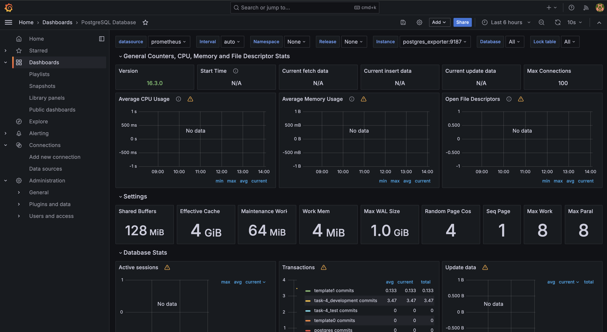
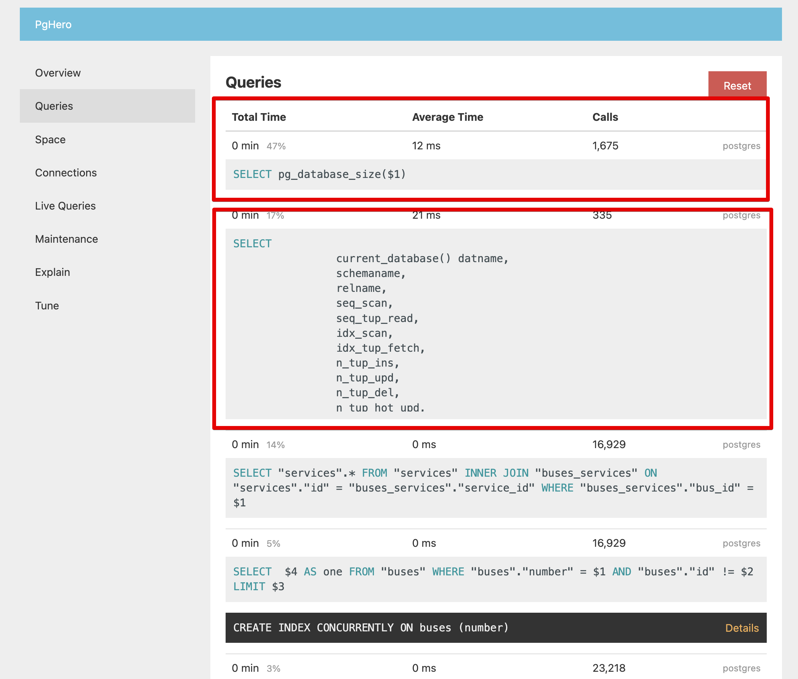

# Case-study оптимизации 1


- [Case-study оптимизации 1](#case-study-оптимизации-1)
  - [Актуальная проблема](#актуальная-проблема)
  - [Формирование метрики](#формирование-метрики)
  - [Feedback-Loop](#feedback-loop)
  - [Знакомство с инструментами и анализ](#знакомство-с-инструментами-и-анализ)
    - [RubyProf и гипотеза с CPU-intensive](#rubyprof-и-гипотеза-с-cpu-intensive)
    - [Установим и запустим pg\_hero](#установим-и-запустим-pg_hero)
    - [Установим и соберем связку prometheus+grafana+postgres\_exporter с помощью docker-compose](#установим-и-соберем-связку-prometheusgrafanapostgres_exporter-с-помощью-docker-compose)
    - [Сгенерируем отчет с помощью pg\_badger](#сгенерируем-отчет-с-помощью-pg_badger)
    - [Отказ от преждевременной оптимизации](#отказ-от-преждевременной-оптимизации)
    - [Оптимизация 1: индексы](#оптимизация-1-индексы)
    - [Оптимизация 2: activerecord-import и потоковый подоход](#оптимизация-2-activerecord-import-и-потоковый-подоход)
    - [Оптимизация 2: попробуем обновить Rails и Ruby](#оптимизация-2-попробуем-обновить-rails-и-ruby)
  - [Вопросы](#вопросы)


## Актуальная проблема
Помимо старой версии ruby и гемов (прощай, Gemfile.lock) и танцев с контейнером Docker для Postgres (привет docker-compose.yml), на первый взгляд проблем обнаружено не было- 12 секунд на загрузку 1000 записей.
Попробуем загрузить 10_000 записей и видим время работы программы уже 90 секунд.

## Формирование метрики
Исходя из этих двух значений, могу предположить, что зависимость как минимум линейная, т.е. при загрузке 100_000 записей время составит уже 15 минут. Считаю текущее значение метрики неприемлемым, ставлю целевой бюджет на загрузку файла размером 100_000 строк в пределах минуты. (Ну вот опять же, сложно не разобравшись с кодом ставить такой бюджет вслепую)

## Feedback-Loop
Поставлю библиотеку RSpec и напишу тест, покрывающий функционал rake-задачи "reload_json"
```ruby
require 'rails_helper'

describe "rake reload_json[fixtures/small.json]" do
  context 'performs 1000 lines under 12s' do
    it {
      expect {
        Rake::Task['reload_json'].invoke('fixtures/small.json')
      }.to perform_under(12).warmup(0).times

      expect(Trip.count).to eq(1000)
    }
  end
end
```
Получаем проверку функционала и времени работы, feedback-loop занимает 12 секунд

## Знакомство с инструментами и анализ

### RubyProf и гипотеза с CPU-intensive

Зададим себе первый вопрос, а может быть проблема в CPU-intensive задаче, может быть JSON.parse занимает у нас много времени?
Из отчетов ruby-prof вижу, что большую часть времени занимают
- PG::Connection#exec_prepared
- PG::Connection#exec_params
Похоже, что проблема все-таки в базе данных

### Установим и запустим pg_hero


Видим несколько предложений создать индексы, видим частые запросы по сервисам (кстати, по сервисам создать индекс не предлагается)

### Установим и соберем связку prometheus+grafana+postgres_exporter с помощью docker-compose

<div float="left">


</div>

### Сгенерируем отчет с помощью pg_badger

Вообще глаза разбегаются, сложно понять, куда смотреть, куча служебных запросов, которые бы вообще лучше проигнорировать, 65К строчек логов postgres только за 2 прогона small.json, сложно

### Отказ от преждевременной оптимизации

В первую очередь чешутся руки пойти и переписать самое начало импортера на какой-нибудь `truncate` или `connection.execute`, однако проверив данные по этим запросам можно увидеть, что они занимают меньше 0.1% от общего времени выполнения, таким образом они не являются главной точкой оптимизации и трогать их мы не будем

### Оптимизация 1: индексы

Воспользуюсь данными отчета Most frequent queries из pg_hero
- `SELECT "services".* FROM "services" WHERE "services"."name" = ? LIMIT ?;`
- `SELECT "cities".* FROM "cities" WHERE "cities"."name" = ? LIMIT ?;`
- `SELECT ? AS one FROM "buses" WHERE "buses"."number" = ? LIMIT ?;`

Выглядит так, как будто нам необходимо построить следующие индексы
- BTree on services.name
- BTree on cities.name
- BTree on buses.number

После создания индекса на buses.number получаем рост времени выполнения импорта с 10 до 17 секунд. Наверное, логично, потому что при записи приходится писать в индекс. Вот тебе и советы от pg_hero)) (возможно связано с включением логирования???)
После создания индексов на services.name вижу снижение времени с 17 до 15 секунд
После создания индексов на cities.name так же не вижу снижения времени выполнения

Считаю эксперимент с индексами неудачным, уверен, что позже они нам понадобятся, однако прямо сейчас попробуем отменить их и выключить режим отладки postgres

### Оптимизация 2: activerecord-import и потоковый подоход

Попробуем переписать код на потоковый подход
После переписывания с помощью потокового чтения файла с данными и обработки через батчи с помощью activerecord-importer получаем результат загрузки large.json за 147 секунд. Это слегка больше, чем наш бюджет, но в целом- терпимо
pg_hero вообще перестал показывать относящиеся к скрипту запросы в своем интерфейсе

### Оптимизация 2: попробуем обновить Rails и Ruby

## Вопросы

1) Такое ощущение, что выгрузка логов для pg_badger сильно замедляет работу, поэтому вопрос, а как в реальном проде обстоят дела с этим? Все логи собираются нонстопом и в нужный момент по нужной выборке запускается pg_badger? Но влияет же на производительность, не?


2) Мы чет не затронули вопрос constraints, а проблема в том, что текущие миграции написаны без использования foreign_keys. Насколько я себе представляю, это прям плохая практика и FK использовать надо обязательно. Однако, в контексте производительности, FK не создают индексов сами по себе и вряд ли как-то ускоряют чтение-запись. Можешь прокомментировать?

3)