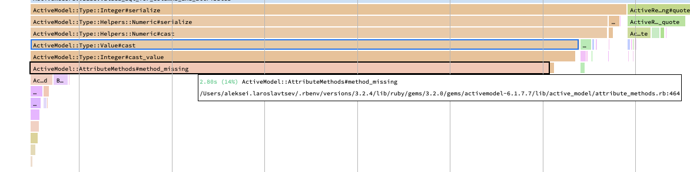

# Case-study Report

## Актуальная проблема

Нужно оптимизировать импорт данных и отображение рассписаний:
- `rake reload_json[fixtures/large.json]` должнен выполняться в пределах минуты; 
- загрузка страницы `автобусы/Самара/Москва` должна укалывать в 200 мс;

## Формирование метрики
Для того, чтобы понимать, дают ли мои изменения положительный эффект на быстродействие программы измеряется время выполнения импорта данных для файла large и скорость закрузки стратрицы.

## Главные точки роста
Для того, чтобы найти "точки роста" для оптимизации я воспользовался инструментами rack-mini-profiler, memory-profiler, pghero и bullet.

### Hаходки
- Использовал gem activerecord-import и следовал рекомендациям по импорту данных: создал вспомогательные справочники для  `cities`, `buses` и использовал `on_duplicate_key_ignore` в связке с `CONSTRAINT for_upsert UNIQUE (bus_id, service_id)`
  * Время выполнения импорта файла `fixtures/large.json` составило 24 секунды
- Профилирование показало, что значительное время уходит на `ActiveModel::AttributeMethods#method_missing` при формировании данных для импорта. Для ускорения данные для импорта формировались с id объекта из справочтика, а не с объектом из справочника. 
  * 
  * Время выполнения импорта файла `fixtures/large.json` составило 18 секунд вместо 24 секунд
  
- Гем bullet показал наличие n+1 при загрузки страницы `автобусы/Самара/Москва`
    * Первым шагом было добалвение загрузки связанных объектов Bus с помощью `includes` для Trip. Время загрузки значительно не изменилось: было 2095.1ms стало 2290ms
    * Вторым шагом было добавлние загрузки связанных объектов Services с помощью `includes`  для Trip и Bus. Время загрузки уменьшилось до 548ms
- Логи показали много обращений к шаблон для рендера
    * Создание общего шаблона для рендера без вложенных шаблонов уменьшило время загрузки страницы `автобусы/Самара/Москва` до 178ms
- Добавление индексов согласно рекомендациям PG Hero сократило время загрузки до 156ms

## Результаты
В результате проделанной оптимизации удалось обработать большой файл с данными за целевое время и значительно ускорить загрузку страницы
