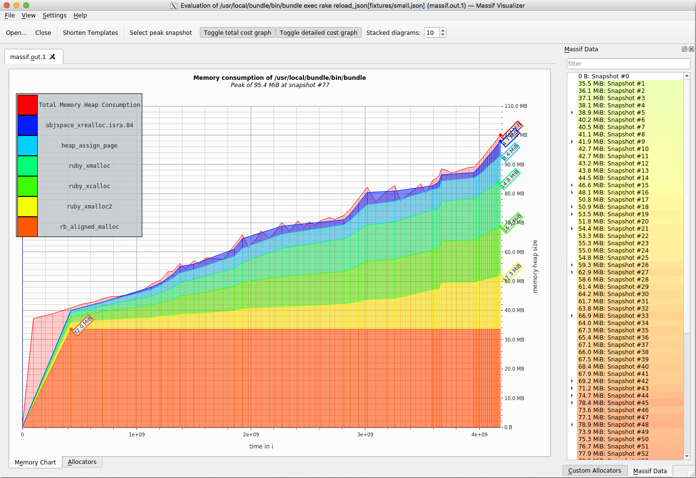

# Case-study оптимизации

## Актуальная проблема
В нашем проекте возникла серьёзная проблема.

Наше приложенене неплохо себя показало на тестовых данных, однако оказалось, что в реальной жизни нам потребуется
загружать и отображать значительно большее количество рейсов, чем мы первоначально планировали.

От бизнеса был получен файл large.json объемом 32MB, выявивший две проблемы: 

1) Слишком медленная загрузка данных в базу
2) Слишком долгое отображение страниц веб-приложением

Попробуем решить обе проблемы. 

## Гарантия корректности работы оптимизированной программы
Напишем тест, проверяющий корректную загрузку и отображение рейсов из файла example.json. Для этого перенесем
логику обработки файла из рейк-таски в отдельный класс и напишем тест, проверяющий корректное отображение страницы
рейсов Самара - Москва

## Первая проблема - Слишком медленная загрузка данных в базу

### Метрика
Я решил использовать две метрики -  непосредственно скорость обработки файла и потребление памяти.
В проекте удобно предоставляются файлы разного размера, что позволит переходить от меньшего файла к большему по мере
оптимизации. 

### Feedback-Loop
Для того, чтобы иметь возможность быстро проверять гипотезы я выстроил `feedback-loop`,
который позволил мне получать обратную связь по эффективности сделанных изменений за 5-10 секунд

`feedback-loop` представляет из себя запуск rake таски импорта файла

- bin/rake reload_json[fixtures/small.json]

в вывод которой я добавил отчет о затраченном времени и потреблении памяти

## Динамика потребления памяти
Прежде всего выясним динамику потребления памяти при импорте данных из файла. Для этого
используем valgrind massif visualier

На графике виден стабильный крутой рост потребления памяти на всем протяжении времени работы скрипта.

Попробуем провести рефакторинг таким образом, чтобы не накапливать данные в памяти.

Так же в отчете ruby_prof qcachegrind видно, что значительно время занимают find_by / 
find_or_create_by методы. Попробуем от них избавиться. 

Значения метрик для файла small.json - 12 секунд, 71 mb

После рефакторинга импорт файла small.json стал занимать 0.91 секунды. Это позволило
имторировать файл large.json за 26 секунд (используя 347 мб рам), что соответствует бюджету.

Коммитим изменения

## Вторая проблема - медленное отображение расписаний после импорта large.json

## Метрика

Я решил использовать в качестве метрики скорость, с которой rails отвечает на запрос страницы
`http://127.0.0.1:3000/автобусы/Самара/Москва`, эти значения можно легко увидеть прямо в
консоли `rails s`

Старотовые значения метрики такие
- Completed 200 OK in 7408ms (Views: 6562.6ms | ActiveRecord: 843.7ms)

#rack-mini-profiler n+1

Подключим rack-mini-profiler и попробуем найти точки роста для оптимизации быстродействия страницы

В логе запущенного приложения можно увидеть подозрительно большое количество sql запросов, а если
рассмотреть страницу `http://127.0.0.1:3000/автобусы/Самара/Москва` через rack-mini-profiler 
можно увидеть явную проблему n+1, страница вызывает 650 sql запросов на рендер каждого _trip.

Попробуем устранить проблему, добавив include d ds,jhre трипов

метрика

- Completed 200 OK in 7408ms (Views: 6562.6ms | ActiveRecord: 843.7ms)

попробуем внести изменения

Количество sql запросов снижается до 8, метрика значительно улучшается (особенно в части ActiveRecord)

- Completed 200 OK in 6053ms (Views: 5985.4ms | ActiveRecord: 64.6ms)

коммитим

#rack-mini-profiler рендернг коллекций

По показанию сметрики мы видем, что основное время занимает рендеринг видов, 
а в отчете rack-mini-profiler можно увидеть множество записей о пендеринге trips/_services и 
самих трипов. Попробуем применить групповой рендеринг, чтобы ускорить отображение страницы

текущая метрика

- Completed 200 OK in 7408ms (Views: 6562.6ms | ActiveRecord: 843.7ms)

попробуем внести изменения

метрика уменьшается до 2,5 секунд

- Completed 200 OK in 2601ms (Views: 2552.5ms | ActiveRecord: 45.8ms)

коммитим