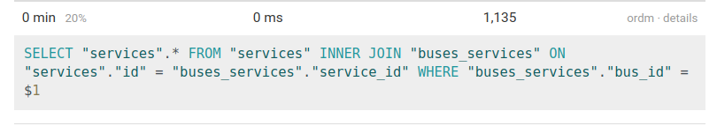
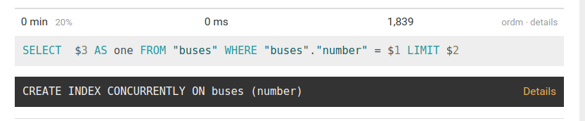
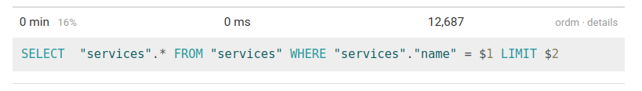
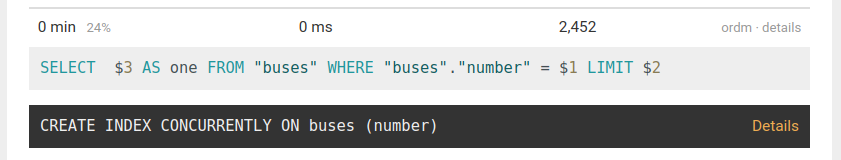
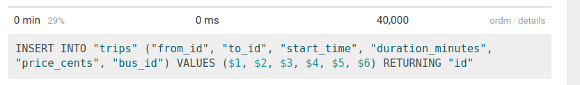
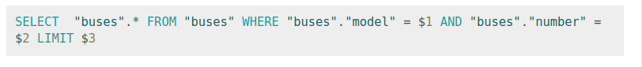
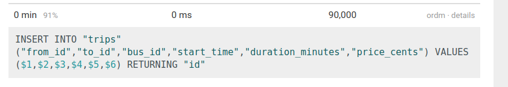

## Проблема №1
Импорт данных на файле large.json занимает больше 10минут, нужно ускорить импорт, чтобы он проходил в пределах минуты.

- Метрика - время выполнения импорта 

## Подготовка
1. Логику импорта вынес в класс и написал тест

## Feedback-Loop
1. Профилирование
2. Изменение кода
3. Тесты
4. Постоение отчета

Время цикла: 10сек - 40сек

## Инструменты
- benchmark
- pg-hero

### Предварительный анализ
Время выполнения  на файле small: 11.822сек

### Находка №1
- 
- Убрал запись сервисов автобусов из цикла, добавил хэш buses_services = { bus_id: service_ids }
- Время выполнения на файле small: снизилось 11.822сек => 6.9сек 
- исправленная проблема перестала быть главной точкой роста

### Находка №2
- 
- Добавил составной индекс %i[model number]
- Время выполнения на файле small: не изменилось 6.9сек
- исправленная проблема перестала быть главной точкой роста

### Находка №3
- 
- Вынес создание сервисов вне цикла и вынес их в хэш { service.name => service.id }
- Время выполнения на файле small: снизилось 6.9сек => 4.415сек
- исправленная проблема перестала быть главной точкой роста

### Находка №4
- 
- Добавил составной индекс на поле number
- Время выполнения на файле small: не изменилось 4.415сек
- Время выполнения на файле medium: 31.257сек
- исправленная проблема перестала быть главной точкой роста

### Находка №5
- 
- Вынес города в хэш { city.name => city.id }
- Время выполнения на файле medium: не изменилось 31.257сек
- исправленная проблема перестала быть главной точкой роста

### Находка №6
-  большое кол-во ставок трипов
- Переписал на массовую вставку с использованием gem activerecord-import
- Время выполнения на файле medium: снизилось 31.257сек => 10.173сек
- исправленная проблема перестала быть главной точкой роста

### Находка №7
- 
- Вынес автобусы в хэш { "#{bus.number}#{bus.model}" => { id: bus.id, services: service_ids }} }
- Время выполнения на файле medium: снизилось 10.173сек => 4.321сек
- исправленная проблема перестала быть главной точкой роста

### Находка №8
- 
- Заменил import на bulk_import c BATCH_SIZE = 10_000
- Время выполнения на файле large: снизилось 90.892сек => 18.219сек
- исправленная проблема перестала быть главной точкой роста

## Результаты
В результате проделанной оптимизации удалось импортировать large файл в пределах минуты(18.219сек).

## Защита от регрессии производительности
Для защиты от потери достигнутого прогресса при дальнейших изменениях программы были написан тест:

```
  it 'works under 30 seconds' do
    expect { described_class.call('fixtures/large.json') }.to perform_under(30)
  end
```