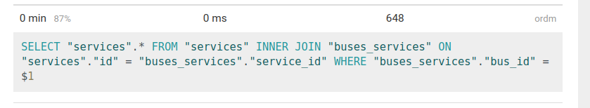

## Проблема №2
Отображение расписаний
Сами страницы расписаний тоже формируются не эффективно и при росте объёмов начинают сильно тормозить.
Нужно найти и устранить проблемы, замедляющие формирование этих страниц.

- Метрика - время формирования страницы

## Подготовка
1. Написал тест на отображение данных, после ипортма example.json

## Feedback-Loop
1. Профилирование
2. Изменение кода
3. Тесты
4. Постоение отчета

Время цикла: 15сек

## Инструменты
- rack-mini-profiler
- bullet
- pg-hero

### Предварительный анализ
Файл: large.json
Время формирования страницы: 28773ms (Views: 27170.6ms | ActiveRecord: 1590.4ms)

### Находка №1
- Большое количество раз рендерится(анализируя данные rack-mini-profiler) service.html.erb
- Добавил render collection: services
- Время формирования страницы: 16495ms (Views: 14751.6ms | ActiveRecord: 1737.5ms)
- исправленная проблема перестала быть главной точкой роста

### Находка №2
- Большое количество раз рендерится(анализируя данные rack-mini-profiler) trip.html.erb и delimiter.html.erb
- Добавил render collection: trips и spacer_template: 'delimiter'
- Время формирования страницы: 8794ms (Views: 7172.4ms | ActiveRecord: 1592.9ms)
- исправленная проблема перестала быть главной точкой роста

### Находка №3
-  N + 1 запрос, анализируя данные rack-mini-profiler видим подгрузку автобусов к поездке и сервисов к автобусам
- Добавил Trip.preload(bus: :services)
- Время формирования страницы: 2783ms (Views: 2736.8ms | ActiveRecord: 40.3ms)
- исправленная проблема перестала быть главной точкой роста

### Находка №4
-  долго считается count
- Добавил load.size
- Время формирования страницы: 2663ms (Views: 2625.0ms | ActiveRecord: 31.0ms)
- исправленная проблема перестала быть главной точкой роста